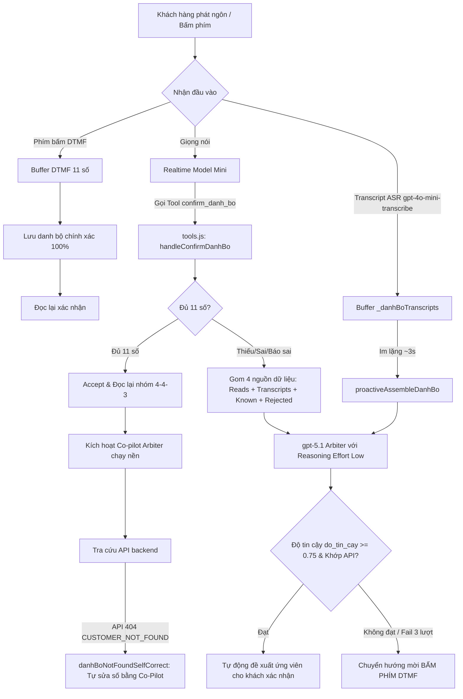

# Kiến Trúc & Cơ Chế Xác Nhận Mã Danh Bộ Chính Xác (Voicebot Cấp Nước Trung An)

Tài liệu này chi tiết hóa toàn bộ **kiến trúc đa lớp (Multi-layered Architecture)**, các **cơ chế xử lý**, **Prompt Engineering**, và các **đoạn code cốt lõi** được thiết kế nhằm đạt độ chính xác tối đa (hướng tới 100%) khi nhận dạng và tra cứu **Mã Danh Bộ (11 chữ số)** qua đường truyền thoại SIP/VoIP.

---

## 1. Bài Toán & Các Thách Thức Kỹ Thuật

Trong hệ thống Voicebot chăm sóc khách hàng Cấp nước, **Mã Danh Bộ** là chìa khóa định danh duy nhất (11 chữ số). Nhận dạng mã danh bộ qua thoại gặp các thách thức nghiêm trọng:

1. **Hạn chế của ASR / Model Thoại Realtime (`gpt-4o-mini-realtime`)**:
   - **Rớt số đầu / nuốt số**: Khi khách vừa nói vừa bị ngắt hơi hoặc đường truyền bị trễ.
   - **Đọc ngắt quãng (Nhiều hơi nói)**: Khách hay đọc tách thành từng cụm (ví dụ: `5248` - dừng - `7336` - dừng - `008`). Semantic VAD ngắt lượt quá sớm khiến model trả lời ngay "chưa đủ 11 số" hoặc bỏ qua cụm đầu.
   - **Chép sai chữ số**: Nhầm lẫn âm tiếng Việt (như `4` ↔ `8`, `0` ↔ `6`, `1` ↔ `7`).
2. **Nhiễu tín hiệu thoại & Prompt Echo**:
   - Tín hiệu âm thanh dội lại từ tổng đài làm ASR transcribe chính prompt của bot thành "lượt nói khách hàng giả", làm AI phản hồi vô nghĩa.
3. **Model tự suy diễn (Hallucination)**:
   - Model mini tự đếm số sai, tự bịa số hoặc tự ý tra cứu API khi khách chưa đồng ý.

---

## 2. Tổng Quan Kiến Trúc Đa Lớp (Multi-layered Architecture)

Để giải quyết triệt để các vấn đề trên, hệ thống triển khai **5 lớp bảo vệ kết hợp (Defense-in-Depth)**:



---

## 3. Chi Tiết Các Cơ Chế & Đoạn Code Cốt Lõi

### 3.1. Lớp 1: Calling Function `confirm_danh_bo` & Đọc Định Dạng 4-4-3

Khi khách đọc chữ số, Realtime Model bắt buộc phải gọi tool `confirm_danh_bo`. 
Hệ thống **không tin tưởng trí nhớ của model mini** mà tự động chuẩn hóa và chia nhóm **4-4-3** (ví dụ: `52487336008` → `5248 7336 008`).

#### Code xử lý định dạng đọc lại (`tools.js`):
```javascript
/** Ép đọc số theo nhóm 4-4-3 tự nhiên qua thoại: "52487336008" → "năm hai bốn tám, bảy ba ba sáu, không không tám" */
function danhBoSpokenGroups(raw) {
  const digits = normalizeDanhBo(raw);
  if (digits.length !== 11) return danhBoSpoken(digits);
  const g1 = digits.slice(0, 4);
  const g2 = digits.slice(4, 8);
  const g3 = digits.slice(8, 11);
  return `${danhBoSpoken(g1)}, ${danhBoSpoken(g2)}, ${danhBoSpoken(g3)}`;
}
```

#### Code xử lý gọi function (`tools.js`):
```javascript
async function handleConfirmDanhBo({ day_so } = {}, callState = {}) {
  const normalized = normalizeDanhBo(day_so);
  const stored = callState.danhBo?.value || null;
  const storedConfirmed = !!callState.danhBo?.confirmed;
  const saidNo = !!callState._danhBoCustomerSaidNo;
  callState._danhBoCustomerSaidNo = false;

  // ── Khách BÁO SAI số đã đọc lại ──────────────────────────────────────────
  const laBaoSai = stored && !storedConfirmed &&
    (normalized.length === 0 || (normalized === stored && saidNo));
  if (laBaoSai) {
    rejectStoredDanhBo(callState);
    // Dùng ngay kết quả Co-pilot ngầm đã tính toán sẵn ở nền
    const verdict = await awaitBackgroundVerdict(callState);
    const resp = await tryProposeArbiterCandidate(verdict, callState);
    if (resp) return resp;
    if ((callState._danhBoReads?.length || 0) >= DANH_BO_MAX_READS) {
      return danhBoDtmfInviteResponse(callState);
    }
    return reReadRequestResponse(callState);
  }

  // ── Khách đọc ĐỦ 11 số ───────────────────────────────────────────────────
  if (normalized.length === DANH_BO_LENGTH) {
    const out = acceptFullDanhBo(normalized, callState);
    fireBackgroundArbiter(callState); // Kích hoạt trọng tài ngầm kiểm tra chéo
    return out;
  }

  // ── Sai độ dài / Chưa đủ số ──────────────────────────────────────────────
  if (reads.length >= 2) {
    const verdict = await runDanhBoArbiter(callState);
    const resp = await tryProposeArbiterCandidate(verdict, callState);
    if (resp) return resp;
  }
  return invalidDanhBoResponse(normalized.length, callState);
}
```

---

### 3.2. Lớp 2: Co-Pilot Trọng Tài Ngầm (`danh-bo-arbiter.js` với `gpt-5.1`)

Khi nhận dạng giọng nói gặp nhiễu hoặc ngắt đoạn, hệ thống sử dụng một **Reasoning Model mạnh (`gpt-5.1`)** đóng vai trò Trọng tài / Co-Pilot chạy ngầm.

#### 4 Nguồn Dữ Liệu Gom Tụ:
1. `reads`: Các dãy số Realtime Model đã nghe qua các lượt.
2. `transcripts`: Mọi câu nói của khách được transcribe độc lập bởi `gpt-4o-mini-transcribe`.
3. `knownDanhBo`: Danh bộ đăng ký theo SĐT người gọi (Caller ID).
4. `rejected`: Các dãy bot từng đọc lại và đã bị khách xác nhận SAI.

#### Prompt Trọng Tài & Ép Cấu Trúc Output JSON Schema (`danh-bo-arbiter.js`):
```javascript
const VERDICT_SCHEMA = {
  type: "json_schema",
  json_schema: {
    name: "danh_bo_verdict",
    strict: true,
    schema: {
      type: "object",
      properties: {
        ma_danh_bo: { type: ["string", "null"], description: "Chuỗi ĐÚNG 11 chữ số hoặc null" },
        do_tin_cay: { type: "number", description: "Độ tin cậy từ 0.0 đến 1.0" },
        ly_do: { type: "string", description: "Giải thích ngắn gọn cách ghép" },
      },
      required: ["ma_danh_bo", "do_tin_cay", "ly_do"],
      additionalProperties: false,
    },
  },
};

export async function arbitrateDanhBo({ reads = [], transcripts = [], knownDanhBo = [], rejected = [] } = {}) {
  // Call API OpenAI chat completions với model gpt-5.1
  const res = await fetch("https://api.openai.com/v1/chat/completions", {
    method: "POST",
    headers: {
      Authorization: `Bearer ${process.env.OPENAI_API_KEY}`,
      "Content-Type": "application/json",
    },
    body: JSON.stringify({
      model: "gpt-5.1",
      messages: [{ role: "user", content: prompt }],
      response_format: VERDICT_SCHEMA,
      reasoning_effort: "low", // Đảm bảo phản hồi nhanh cho cuộc gọi thoại
    }),
  });
  // ...
}
```

#### Co-Pilot Tự Gom Số Khi Khách Đọc Tách Hơi (`proactiveAssembleDanhBo`):
Nếu model mini không nhận diện được khách đọc tách hơi (Semantic VAD cắt lượt), hàm này sẽ tự động chạy sau 3 giây im lặng để ghép các transcript lại:

```javascript
export async function proactiveAssembleDanhBo(callState = {}) {
  if (callState.danhBo) return null; // Đã có danh bộ → không chen ngang
  if (callState._danhBoDtmfInvited) return null;

  callState._danhBoAssembleTries = (callState._danhBoAssembleTries || 0) + 1;
  const verdict = await runDanhBoArbiter(callState, { waitTranscriptMs: 0 });
  const resp = await tryProposeArbiterCandidate(verdict, callState);
  if (resp) {
    try { return JSON.parse(resp).doc_cho_khach || null; } catch { return null; }
  }
  return null;
}
```

---

### 3.3. Lớp 3: Tự Động Sửa Lỗi API 404 (`danhBoNotFoundSelfCorrect`)

Nếu danh bộ do model/khách cung cấp không tồn tại trên hệ thống DB (trả về lỗi `CUSTOMER_NOT_FOUND`), hệ thống không báo lỗi ngay mà tự động gọi Co-Pilot để tìm ứng viên khớp nhất và đọc lại để hỏi khách:

```javascript
export async function danhBoNotFoundSelfCorrect(callState = {}) {
  const current = callState.danhBo?.value;
  if (!current) return null;

  rejectStoredDanhBo(callState); // Bác bỏ dãy số sai này
  const verdict = await runDanhBoArbiter(callState);
  return tryProposeArbiterCandidate(verdict, callState);
}
```

---

### 3.4. Lớp 4: DTMF Fallback (Bấm Phím Điện Thoại)

Khi đường truyền giọng nói quá nhiễu hoặc qua `DANH_BO_MAX_READS` (3 lượt) không thành công, hệ thống chuyển sang chế độ **bấm phím điện thoại**.

- Nhận event `input_audio_buffer.dtmf_event_received` trực tiếp từ giao thức SIP.
- Khách bấm phím `*` để nhập lại từ đầu.
- Đủ 11 phím bấm → Độ chính xác 100%.

```javascript
case "input_audio_buffer.dtmf_event_received": {
  const digit = String(event.event ?? "").trim();
  if (digit === "*") {
    _toolCallState._dtmfBuffer = ""; // Reset buffer
    break;
  }
  if (!/^\d$/.test(digit)) break;

  _toolCallState._dtmfBuffer = (_toolCallState._dtmfBuffer || "") + digit;
  if (_toolCallState._dtmfBuffer.length === 11) {
    const _dtmfValue = _toolCallState._dtmfBuffer;
    _toolCallState.danhBo = { value: _dtmfValue, confirmed: false };
    const _dtmfPrompt = `Dạ, em nhận được mã danh bộ Quý Khách vừa bấm là: ${danhBoSpoken(_dtmfValue)}. Quý Khách xác nhận giúp em có đúng không ạ?`;
    _speakVerbatim(_dtmfPrompt, "dtmf_danh_bo_confirm");
  }
  break;
}
```

---

### 3.5. Lớp 5: Gate Xác Nhận Lời Nói (`_danhBoNeedsVerbalYes`)

Để ngăn chặn trường hợp Trọng tài gợi ý số nhưng model lại **tự tiện gọi tool tra cứu** mà chưa có lời đồng ý từ khách:

1. Khi Trọng tài đề xuất ứng viên, đặt cờ `callState._danhBoNeedsVerbalYes = true`.
2. Hàm `resolveDanhBo()` sẽ **chặn toàn bộ các tool tra cứu** (như `get_bill`, `get_payment_status`) và ép đọc lại câu hỏi xác nhận nếu cờ này chưa được gỡ.
3. Cờ chỉ được gỡ khi ASR ghi nhận khách thực sự phát ngôn các từ khẳng định (`_isAffirmative`: "đúng rồi", "phải", "chính xác", "ừ", "đúng").

---

## 4. Cơ Chế Prompt Engineering & Chống Dội Âm (Prompt Echo)

### 4.1. Quy Tắc Prompt Trong System Prompt (`system-prompt.js`)

- **Bắt buộc gọi tool `confirm_danh_bo`**: Khách vừa đọc số (lần đầu hay sửa lại) → gọi `confirm_danh_bo` ngay lập tức.
- **Cấm tự đọc từ trí nhớ**: Khách đọc xong, bot CHỈ ĐƯỢC đọc lại nguyên văn chuỗi `doc_cho_khach` do tool trả về.
- **Tuân thủ DTMF**: Khi kết quả tool trả về `moi_bam_phim`, bot tuyệt đối không tự đoán số từ tiếng bấm phím.

### 4.2. Cơ Chế Hủy Response Khi Bị Dội Âm (Prompt Echo Cancel)

Khi âm thanh của bot dội ngược lại micro khách hàng, ASR ghi nhận transcript trùng với `transcription.prompt`. Hệ thống phát hiện và **hủy ngay lập tức response giả** do nhiễu kích hoạt:

```javascript
const _isPromptEcho = !!(_nk && _np && (
  _nk === _np ||
  (_nk.length >= 20 && _np.includes(_nk)) ||
  (_sig.length >= 20 && _nk.includes(_sig)) // Match 40 ký tự đầu tiên (chữ ký prompt)
));

if (_isPromptEcho && _responseActive && !_unansweredRealTurn) {
  ws.send(JSON.stringify({ type: "response.cancel" }));
  logger.addEvent("response_cancel_sent", "Hủy response do prompt echo (nhiễu) kích hoạt");
}
```

---

## 5. Tổng Kết Đánh Giá Kiến Trúc

Với sự kết hợp của 5 lớp trên:
1. **Realtime Speed**: Phản hồi tức thì khi khách đọc trôi chảy (lớp 1).
2. **AI Reasoning Intelligence**: Gom và sửa lỗi đọc ngắt ngắt/sai số bằng `gpt-5.1` (lớp 2 & 3).
3. **Deterministic Accuracy**: Nhập phím DTMF chính xác 100% khi nhận dạng giọng nói thất bại (lớp 4).
4. **Strict Guardrails**: Ép đọc nguyên văn + Gate xác nhận lời nói + Chống dội âm (lớp 5 & prompt).

Hệ thống đảm bảo **không bao giờ tra cứu nhầm danh bộ của khách hàng khác** và giữ trải nghiệm giao tiếp thoại tự nhiên, mượt mà.
